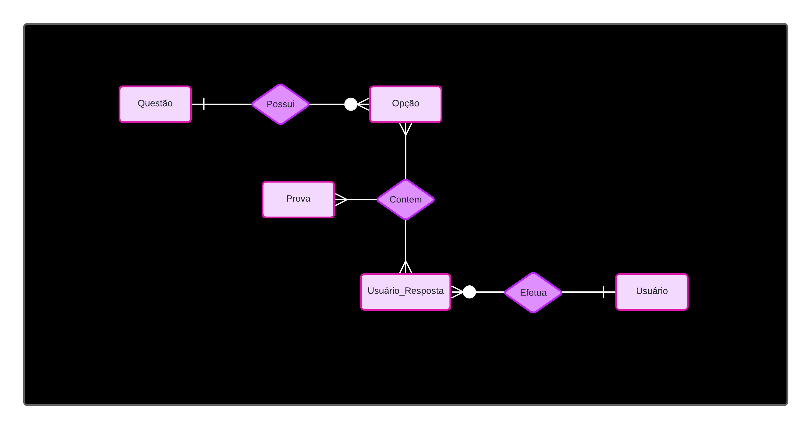
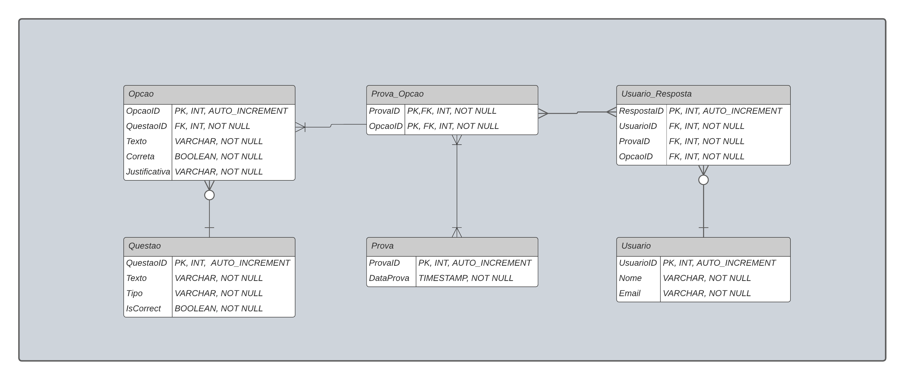

##                            **Sistema Quiz** 

### **Visão Geral** 

A estrutura do arquivo JSON representa um conjunto de registros relacionados a questões de um quiz, incluindo as opções de resposta e justificativas. A análise dessa estrutura foi fundamental para definir o modelo de dados lógico e relacional que suportará o sistema.

### **1. Estrutura JSON**

```json
{
  "1": {
    "type": "quiz",
    "text": "Exemplo de enunciado da questão?",
    "options": [
      {
        "text": "Opção A",
        "explanation": "Justificativa para a opção A.",
        "correct": false
      },
      {
        "text": "Opção B",
        "explanation": "Justificativa para a opção B.",
        "correct": true
      }
    ]
  }
}
```

* **Id**: Identificador único da questão (chave primária).
* **Type**: Define o tipo do registro, sempre "quiz" para esse tipo de estrutura.
* **Text**: Texto do enunciado da questão.
* **Options**: Conjunto de opções de resposta, cada uma contendo o texto da opção, uma explicação e um indicador de se é a resposta correta.

### 2. **Modelo de Dados Lógico**

Com base na análise da estrutura JSON, foi desenvolvido o modelo de dados lógico, que representa as entidades principais do sistema de quiz e seus relacionamentos.



#### **Entidades** 

* **Questão:** Representa as perguntas do quiz.
  * **Atributos:** `QuestaoID`, `Texto`, `Tipo`. 
* **Opção:** Alternativas de resposta para cada questão.
  * **Atributos:** `OpcaoID`, `QuestaoID`, `Texto`, `Correta`, `Justificativa`. 
* **Prova:** Representa uma avaliação ou teste realizado no Quiz.
  * **Atributos:** `ProvaID`, `DataProva`.  

* **Usuário_Resposta:** Registra as respostas selecionadas pelos usuários em cada prova.
  *  Atributos: `RespostaID`, `UsuarioID`, `ProvaID`, `OpcaoID`. 
* **Usuário**:  Armazena informações dos participantes do quiz.
  * Atributos: `UsuarioID`, `Nome`, `Email`. 

**Relacionamentos**

* **Possui:** Relaciona as entidades: `Questao`  e `Opção`. 
* **Contem:** Relaciona as entidades: `Opção` ,`Prova` e `Usuário_Resposta`. 
* **Efetua:** Relaciona as entidades: `Usuario_Resposta` e `Usuário`. 

### 3. **Modelo de Dados Relacional**

Com o modelo de dados lógico em mente, foi gerado o modelo de dados relacional, onde cada entidade se transforma em uma tabela no banco de dados. O modelo também define as chaves primárias (PK), chaves estrangeiras (FK), e outros detalhes de implementação. 



#### 4. **Script DDL** 

O script DDL é utilizado para implementar o modelo de dados desenhado previamente de forma relacional, garantindo que as tabelas, campos e chaves sigam as especificações definidas no dicionário de dados.

```sql
-- Tabela Questão
CREATE TABLE Questao (
    QuestaoID INT PRIMARY KEY AUTO_INCREMENT,
    Texto VARCHAR(255) NOT NULL,
    Tipo VARCHAR(100) NOT NULL,
    IsCorrect BOOLEAN NOT NULL

);

COMMENT ON TABLE Questao IS 'Todas as questões presentes em uma prova. Cada questão é identificada por um ID único e contém um texto descritivo e um tipo, que determina como a questão será apresentada ao usuário e quais tipos de resposta serão aceitos.';
COMMENT ON COLUMN Questao.QuestaoID IS 'Identificador único de cada questão. É uma chave primária (PK) auto-incrementada que serve para diferenciar cada pergunta registrada no sistema.';
COMMENT ON COLUMN Questao.Texto IS 'Texto completo da questão que será apresentada ao usuário. Este campo deve ser preenchido com clareza e precisão, garantindo que a questão esteja compreensível para os usuários.';
COMMENT ON COLUMN Questao.Tipo IS 'Tipo de questão, que pode ser, "verdadeiro/falso". Essa categorização é usada para determinar como as opções de resposta devem ser configuradas e como as respostas do usuário devem ser interpretadas. O campo Tipo deve seguir um padrão previamente estabelecido para garantir a consistência nos dados.';
COMMENT ON COLUMN Questao.IsCorrect IS 'Campo booleano que indica se a questão possui ao menos uma resposta correta entre suas opções. O valor deve ser true (verdadeiro) se a questão possui ao menos uma opção correta associada, e false (falso) caso contrário. Esse campo é obrigatório (NOT NULL) e auxilia na validação de questões durante o cadastro, garantindo que cada questão tenha uma opção correta definida. Regra: Uma questão deve ter pelo menos uma resposta correta associada para ser considerada válida para provas ou quizzes.';

-- Tabela Opção
CREATE TABLE Opcao (
    OpcaoID INT PRIMARY KEY AUTO_INCREMENT,
    QuestaoID INT NOT NULL,
    Texto VARCHAR(255) NOT NULL,
    Correta BOOLEAN NOT NULL,
    Justificativa VARCHAR (255) NOT NULL, -- armazenar a justificativa de cada opção
    FOREIGN KEY (QuestaoID) REFERENCES Questao(QuestaoID) ON DELETE CASCADE -- Restrição de integridade referencial (se a questão for excluída, as opções associadas também serão)
);

COMMENT ON TABLE Opcao IS 'Opções de resposta para cada questão cadastrada no sistema. Cada opção é associada a uma única questão e possui uma indicação se é a resposta correta ou não. É utilizada para validar as respostas dos usuários e fornecer explicações detalhadas sobre cada alternativa.';
COMMENT ON COLUMN Opcao.OpcaoID IS 'Identificador único de cada opção de resposta. É uma chave primária (PK) auto-incrementada que diferencia cada opção cadastrada.';
COMMENT ON COLUMN Opcao.QuestaoID IS 'Chave estrangeira (FK) que relaciona a opção de resposta à questão correspondente. Garante a integridade referencial, vinculando a opção a uma única questão na tabela "Questao". Se uma questão for excluída, todas as opções associadas a ela também serão excluídas (ON DELETE CASCADE).';
COMMENT ON COLUMN Opcao.Texto IS 'Texto descritivo da alternativa de resposta apresentada ao usuário para cada questão associada. Facilitando a escolha e compreensão por parte do usuário. Cada texto deve corresponder a uma alternativa única e ser formulado de modo que evite ambiguidade, garantindo que o usuário consiga identificar a resposta correta ou incorreta de maneira intuitiva.';
COMMENT ON COLUMN Opcao.Correta IS 'Campo booleano que indica se a opção de resposta é correta (TRUE) ou incorreta (FALSE). Este campo é utilizado na avaliação das respostas dos usuários para determinar se a escolha foi correta ou não. Cada questão pode ter uma ou mais opções corretas, dependendo do tipo de questão.';
COMMENT ON COLUMN Opcao.Justificativa IS 'Explicação sobre por que a opção está correta ou incorreta. Este campo é usado para fornecer feedback ao usuário, detalhando o motivo de sua escolha estar certa ou errada. A justificativa deve ser objetiva e educacional, para auxiliar no aprendizado ou esclarecimento do tema abordado pela questão.';

-- Tabela Prova
CREATE TABLE Prova (
    ProvaID INT PRIMARY KEY AUTO_INCREMENT,
    DataProva TIMESTAMP NOT NULL
);
COMMENT ON TABLE Prova IS 'Armazena as informações de cada prova realizada no sistema. Cada prova representa uma avaliação aplicada aos usuários em um determinado momento, indicada pelo campo "DataProva". Identificada unicamente pelo campo "ProvaID". As provas são associadas a opções de resposta e usuários por meio das tabelas intermediárias "Prova_Opção" e "Usuario_Resposta". Regras: A data da prova deve ser preenchida obrigatoriamente (NOT NULL) e deve ser registrada no momento em que a prova é criada.';
COMMENT ON COLUMN Prova.ProvaID IS 'Identificador único de cada prova. É uma chave primária (PK) auto-incrementada que diferencia cada prova cadastrada no sistema.';
COMMENT ON COLUMN Prova.DataProva IS 'Campo que registra a data e a hora em que a prova foi aplicada. É obrigatório (NOT NULL) e é utilizado para controlar o histórico de provas realizadas no sistema.';

-- Tabela Prova_Opção
CREATE TABLE Prova_Opção (
    ProvaID INT NOT NULL, 
    OpcaoID INT NOT NULL, 
    PRIMARY KEY (ProvaID, OpcaoID), -- Chave primária composta
    FOREIGN KEY (ProvaID) REFERENCES Prova(ProvaID) ON DELETE CASCADE, 
    FOREIGN KEY (OpcaoID) REFERENCES Opcao(OpcaoID) ON DELETE CASCADE 
);

COMMENT ON TABLE Prova_Opção IS 'Intermediária que relaciona as provas com as opções de resposta apresentadas aos usuários. Permite armazenar as opções de resposta exibidas em cada prova. Identificada por uma chave primária composta (ProvaID, OpcaoID). Regras: Se uma prova ou uma opção for excluída, o relacionamento correspondente também será excluído (ON DELETE CASCADE).';
COMMENT ON COLUMN Prova_Opção.ProvaID IS 'Identificador da prova à qual a opção de resposta foi apresentada. Chave estrangeira (FK) que garante a integridade referencial com a tabela "Prova".';
COMMENT ON COLUMN Prova_Opção.OpcaoID IS 'Identificador da opção de resposta apresentada na prova. Chave estrangeira (FK) que garante a integridade referencial com a tabela "Opcao".';

-- Tabela Usuário
CREATE TABLE Usuario (
    UsuarioID INT PRIMARY KEY AUTO_INCREMENT,
    Nome VARCHAR(255) NOT NULL,
    Email VARCHAR(255) NOT NULL
);

COMMENT ON TABLE Usuario IS 'Armazena os dados cadastrais dos usuários que realizam as provas ou quizzes no sistema. Cada usuário é identificado unicamente pelo campo "UsuarioID". Regras: O nome e o e-mail são campos obrigatórios (NOT NULL). O e-mail deve ser único para garantir a identificação individual de cada usuário.';
COMMENT ON COLUMN Usuario.UsuarioID IS 'Identificador único de cada usuário. É uma chave primária (PK) auto-incrementada que diferencia cada usuário cadastrado.';
COMMENT ON COLUMN Usuario.Nome IS 'Nome completo do usuário. É um campo obrigatório (NOT NULL) e deve ser preenchido com o nome real para facilitar a identificação do usuário no sistema.';
COMMENT ON COLUMN Usuario.Email IS 'Endereço de e-mail do usuário. É um campo obrigatório (NOT NULL) e deve ser preenchido com um e-mail válido para garantir o contato e a identificação única do usuário.';

-- Tabela Usuario_Resposta 
CREATE TABLE Usuario_Resposta (
    RespostaID INT PRIMARY KEY AUTO_INCREMENT,
    UsuarioID INT NOT NULL,
    ProvaID INT NOT NULL,
    OpcaoID INT NOT NULL,
    FOREIGN KEY (UsuarioID) REFERENCES Usuario(UsuarioID) ON DELETE CASCADE,
    FOREIGN KEY (ProvaID, OpcaoID) REFERENCES Prova_Opcao(ProvaID, OpcaoID) ON DELETE CASCADE
);

COMMENT ON TABLE Usuario_Resposta IS 'Armazena as respostas fornecidas pelos usuários para cada questão de uma prova. Cada registro corresponde a uma resposta dada por um usuário para uma opção de resposta específica. Identificado unicamente pelo campo "RespostaID". Regras: As chaves estrangeiras garantem que as respostas estejam vinculadas corretamente ao usuário, à prova e à opção correspondente.';
COMMENT ON COLUMN Usuario_Resposta.RespostaID IS 'Identificador único de cada resposta registrada pelo usuário. É uma chave primária (PK) auto-incrementada que diferencia cada resposta cadastrada no sistema.';
COMMENT ON COLUMN Usuario_Resposta.UsuarioID IS 'Identificador do usuário que respondeu à prova. Chave estrangeira (FK) que garante a integridade referencial com a tabela "Usuario". Se um usuário for excluído, suas respostas também serão removidas (ON DELETE CASCADE).';
COMMENT ON COLUMN Usuario_Resposta.ProvaID IS 'Identificador da prova à qual a resposta está associada. Chave estrangeira (FK) que garante a integridade referencial com a tabela "Prova_Opção".';
COMMENT ON COLUMN Usuario_Resposta.OpcaoID IS 'Identificador da opção de resposta escolhida pelo usuário durante a prova. Chave estrangeira (FK) que garante a integridade referencial com a tabela "Prova_Opção".';
```

#### **Estruturação com DDL**

* **Padronização:** O uso de DDL garante que a estrutura do banco de dados seja criada de maneira consistente e padronizada, de acordo com o modelo de dados aprovado.

* **Documentação Integrada:** Com os comentários embutidos no script, a estrutura do banco de dados é autoexplicativa, facilitando o entendimento e a manutenção por equipes futuras.

* **Segurança e Performance:** As restrições de integridade e os tipos de dados definidos no script ajudam a garantir a segurança dos dados e otimizam o desempenho das operações no banco de dados.

### **5. Dicionário de Dados** 

O dicionário de Dados descreve detalhadamente cada tabela e coluna presente no banco de dados. Fornece informações sobre atributos, tipos de dados, restrições e uma breve descrição de cada campo, facilitando a compreensão e o gerenciamente do modelo de dados. 

##### **Entidade Questão**

| Atributo  | Tipo de Dado | Comprimento |     Restrições     |                    Descrição                    |
| :-------: | :----------: | :---------: | :----------------: | :---------------------------------------------: |
| QuestaoID |   Inteiro    |   4 bytes   | PK, AUTO_INCREMENT |         Identificador único da questão          |
|   Texto   |   Varchar    |  255 bytes  |      NOT NULL      |                Texto da questão                 |
|   Tipo    |   Varchar    |  100 bytes  |      NOT NULL      |                 Tipo da questão                 |
| IsCorrect |   Booleano   |   1 byte    |      NOT NULL      | Indica se a questão possui uma resposta correta |

##### Entidade Opção

|   Atributo    | Tipo de Dado | Comprimento |     Restrições     |                        Descrição                         |
| :-----------: | :----------: | :---------: | :----------------: | :------------------------------------------------------: |
|    OpcaoID    |   Inteiro    |   4 bytes   | PK, AUTO_INCREMENT |               Identificador único da opção               |
|   QuestaoID   |   Inteiro    |   4 bytes   |    FK, NOT NULL    |           Identificador da questão relacionada           |
|     Texto     |   Varchar    |  255 bytes  |      NOT NULL      |                      Texto da opção                      |
|    Correta    |   Booleano   |   1 byte    |      NOT NULL      |      Indica se a opção é a correta (true ou false)       |
| Justificativa |   Varchar    |  255 bytes  |      NOT NULL      | Explicação que descreve por que a opção é correta ou não |

##### Entidade Prova

| Atributo  | Tipo de Dado | Comprimento |     Restrições     |             Descrição              |
| :-------: | :----------: | :---------: | :----------------: | :--------------------------------: |
|  ProvaID  |   Inteiro    |   4 bytes   | PK, AUTO_INCREMENT |    Identificador único da prova    |
| DataProva |  TimeStamp   |   3 bytes   |      NOT NULL      | Data e hora de realização da prova |

##### Entidade Prova_Opção

| Atributo | Tipo de Dado | Comprimento |    Restrições    |          Descrição           |
| :------: | :----------: | :---------: | :--------------: | :--------------------------: |
| ProvaID  |   Inteiro    |   4 bytes   | PK,FK, NOT NULL  | Identificador único da prova |
| OpcaoID  |   Inteiro    |   4 bytes   | PK, FK, NOT NULL | Identificador único da opção |

##### Entidade Usuário

| Atributo  | Tipo de Dado | Comprimento |     Restrições     |           Descrição            |
| :-------: | :----------: | :---------: | :----------------: | :----------------------------: |
| UsuarioID |   Inteiro    |   4 bytes   | PK, AUTO_INCREMENT | Identificador único do usuário |
|   Nome    |   Varchar    |  255 bytes  |      NOT NULL      |    Nome completo do usuário    |
|   Email   |   Varchar    |  255 bytes  |      NOT NULL      |        Email do usuário        |

##### Entidade Usuário_Resposta

|  Atributo  | Tipo de Dado | Comprimento |     Restrições     |                 Descrição                  |
| :--------: | :----------: | :---------: | :----------------: | :----------------------------------------: |
| RespostaID |   Inteiro    |   4 bytes   | PK, AUTO_INCREMENT | Identificador único da resposta do usuário |
| UsuarioID  |   Inteiro    |   4 bytes   |    FK, NOT NULL    |   Identificador do usuário que respondeu   |
|  ProvaID   |   Inteiro    |   4 bytes   |    FK, NOT NULL    |      Identificador da prova associada      |
|  OpcaoID   |   Inteiro    |   4 bytes   |    FK, NOT NULL    |     Identificador da opção selecionada     |

#### **Estrutura Dicionário de Dados**

* **Atributos:** São as colunas das tabelas que armazenam os dados.

* **Tipos de Dados:** Especificam o formato dos dados armazenados em cada coluna (por exemplo, inteiros, caracteres). 

* **Comprimento:** Define o tamanho máximo dos dados para tipos como strings e inteiros.

* **Restrições:** Impõem regras sobre os valores armazenados (por exemplo, chaves primárias, chaves estrangeiras, valores obrigatórios).

* **Descrição:** Fornece uma explicação sobre o propósito de cada campo e tabela.